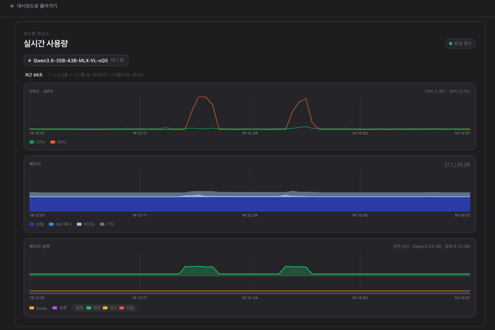

# omlx-resource-monitor

A live resource monitor for [oMLX](https://github.com/jundot/omlx) — adds a
**Monitoring** tab to the admin dashboard that shows real-time CPU, GPU,
memory breakdown, memory pressure, swap, compressed memory, and per-request
PP/TG progress.

> ⚠ This is a **community sidecar**, not part of oMLX. It works by injecting
> a tab into the admin navbar via nginx `sub_filter`. Tracking a feature
> request to make this a first-class oMLX feature in
> [jundot/omlx#TODO](#).



## What it shows

- **CPU / GPU** — usage % with per-core P/E split, GPU clock, and power in tooltip.
- **Memory** — stacked breakdown of *model weights / hot KV cache / runtime
  / other macOS usage* over time. Hover the header for a quick GB breakdown.
- **Memory pressure + Swap + Compressor** — kernel jetsam level driving the
  band color, plus swap and compressor sizes on a shared timeline.
- **Live activity** — per-model badges with PP progress (`processed/total
  tokens`, speed, ETA) and TG (`tok/s`, generated tokens, elapsed). Multiple
  in-flight requests stack inside the same badge.
- Ctrl+scroll to zoom (30 s ~ 1 h window). Shift+scroll to pan into the past.
  Hover stays anchored to the mouse pointer as the graph scrolls in live mode.

## How it works

```
┌─ resource_logger.py (single Python process, stdlib only) ────┐
│                                                              │
│   main loop (2 Hz)             SSE server (thread)           │
│   ┌──────────────────┐         ┌──────────────────┐          │
│   │ collect():       │         │ /stream endpoint │          │
│   │  - macmon /json  │         │  on connect:     │          │
│   │  - sysctl + vm_stat ─────▶ │   send 1 h seed  │ ──▶ browser
│   │  - memory_pressure         │  hold connection │  (EventSource)
│   │  - /admin/api/stats        │  push tick msgs  │          │
│   └──────────────────┘         └──────────────────┘          │
│         │                                                    │
│         ├──▶ in-memory ring buffer (last 1 h × 2 Hz)         │
│         └──▶ raw log: resource.log (1 Hz append, JSONL)      │
│             └─ rotate daily → YYYY-MM-DD.log.gz (30 d)       │
└──────────────────────────────────────────────────────────────┘
                       │
                       ▼ proxy_buffering off
                ┌──────────────┐
                │   nginx      │  inject "Monitoring" tab into oMLX navbar
                │   (auth_request → /admin/api/server-info)
                └──────────────┘
                       │
                       ▼
                 monitor.html  ──▶  panel.js  ──▶  Canvas 2D charts
                                    (EventSource client, no polling)
```

**Sources per tick:**

| What                                   | Source                                  | Cost   |
| -------------------------------------- | --------------------------------------- | ------ |
| CPU/GPU usage, power, temp, P/E split  | [`macmon serve --interval 500`](https://github.com/vladkens/macmon) over HTTP | ~3 ms  |
| Memory pressure level, swap size       | `sysctl`                                | <1 ms  |
| Compressor / active / wired pages      | `vm_stat` parse                         | ~1 ms  |
| Activity Monitor's "free %"            | `memory_pressure` command               | ~3 ms  |
| Model weights, hot KV, per-request PP/TG | oMLX `/admin/api/stats` (existing endpoint) | ~5 ms  |

**Total ≈ 18 ms × 2 Hz ≈ 3.6 %** of one core. Adding macmon (~7 % one core)
totals well under 1 % of an M4 Max.

## Requirements

- macOS arm64 (Apple Silicon).
- Apache-2.0 licensed dependencies, all sudo-less:
  - [oMLX](https://github.com/jundot/omlx) (the thing you're monitoring) — `:8000`
  - [nginx](https://nginx.org/) — `brew install nginx` — reverse proxy on `:8443`
  - [macmon](https://github.com/vladkens/macmon) — `brew install macmon` — `:9090`
  - Python 3 (Apple's stock `/usr/bin/python3` works; uses stdlib only)

## Install

```bash
git clone https://github.com/lbm1202/omlx-resource-monitor.git
cd omlx-resource-monitor
./scripts/install.sh
```

What it does:

1. Sanity-checks macOS arm64, Python 3, nginx, oMLX, macmon.
2. Copies runtime files into `~/.local/share/omlx-resource-monitor/`.
3. Installs the nginx server block at `/opt/homebrew/etc/nginx/servers/omlx-resource-monitor.conf`
   and reloads nginx.
4. Installs a LaunchAgent (`com.omlx-resource-monitor`) that runs
   `resource_logger.py` on login and restarts it on crash.
5. Ensures `macmon serve --interval 500` is running as its own LaunchAgent.

Then browse to:

```
http://127.0.0.1:8443/admin/monitor
```

You'll need a live oMLX admin session — sign in to `/admin` first if you don't
have one.

### Flags

```
./scripts/install.sh --help
./scripts/install.sh --dry-run         # preview without changing anything
./scripts/install.sh --install-dir /path  # override install location
./scripts/install.sh --skip-macmon     # if you already manage macmon yourself
./scripts/install.sh -y                # don't prompt
```

## Uninstall

```bash
./scripts/uninstall.sh
```

Defaults preserve `~/resource-logs/` and macmon. Use `--drop-logs` /
`--purge-macmon` to nuke those too.

## Configuration

Tunable via environment variables (read at logger startup):

| Variable                       | Default                          |
| ------------------------------ | -------------------------------- |
| `OMLX_MONITOR_LOG_DIR`         | `~/resource-logs`                |
| `OMLX_MONITOR_SSE_BIND`        | `127.0.0.1`                      |
| `OMLX_MONITOR_SSE_PORT`        | `9091`                           |
| `OMLX_BASE`                    | `http://127.0.0.1:8000`          |
| `OMLX_SETTINGS_PATH`           | `~/.omlx/settings.json`          |
| `MACMON_URL`                   | `http://127.0.0.1:9090/json`     |

Set these via your LaunchAgent's `EnvironmentVariables` block if you need
non-defaults.

## Languages

The panel detects oMLX's configured UI language via `/admin/api/global-settings`
and currently ships translations for:

- `en` (English) — fallback for unsupported oMLX languages
- `ko` (한국어)

Translations live in [`src/panel.js`](src/panel.js) at the top of the file (`I18N`
dictionary). PRs adding `zh`, `zh-TW`, `ja`, etc. are welcome.

## Storage

- **Active log**: `~/resource-logs/resource.log` — JSON Lines, 1 Hz append.
- **Rotated**: `~/resource-logs/YYYY-MM-DD-resource.log.gz` — gzipped each
  midnight (~8× compression for this kind of repetitive data).
- **Retention**: 30 days; older `.log.gz` files are deleted automatically.

A typical day at 1 Hz is ~40 MB plain / ~5 MB gzipped, so 30 days fits in
~150 MB.

## Debugging

```bash
# Current in-memory state (pretty-printed JSON)
curl -s http://127.0.0.1:8443/custom/state | jq

# Watch the live SSE stream
curl -N http://127.0.0.1:8443/custom/stream

# Logger stdout/stderr
tail -f ~/.omlx-resource-monitor.log

# Today's archived samples
tail -F ~/resource-logs/resource.log | jq

# Yesterday (gzipped)
gzcat ~/resource-logs/$(date -v-1d +%Y-%m-%d)-resource.log.gz | jq -c
```

## License

Apache-2.0 — see [LICENSE](LICENSE). oMLX itself is also Apache-2.0.

## Credits

- [oMLX](https://github.com/jundot/omlx) by [@jundot](https://github.com/jundot) — the inference server this monitors.
- [macmon](https://github.com/vladkens/macmon) by [@vladkens](https://github.com/vladkens) — sudo-less Apple Silicon metrics.
